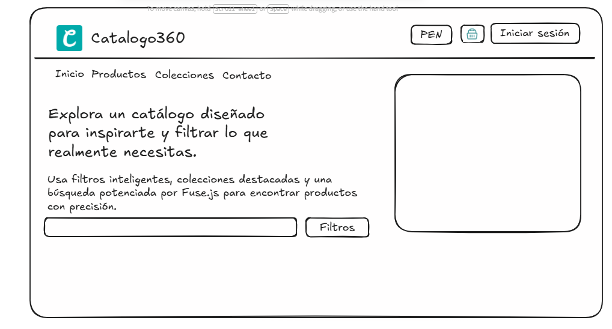

# 🛍️ Catalogo360

<div align="center">


**Una plataforma moderna de catálogo de productos con filtrado inteligente, autenticación de usuarios y experiencia de usuario premium.**

[Características](#-características) • [Instalación](#-instalación) • [Uso](#-uso) • [Tecnologías](#-tecnologías) • [Contribuir](#-contribuir)

</div>

---

## ✨ Características

### 🎨 **Interfaz de Usuario Premium**

- ✅ Diseño moderno y responsivo con **Tailwind CSS**
- ✅ Animaciones fluidas con **GSAP** y **ScrollTrigger**
- ✅ Efecto de escritura dinámica con **TypewriterJS**
- ✅ Notificaciones toast personalizadas
- ✅ Modo oscuro y paleta de colores armoniosa

### 🔐 **Sistema de Autenticación Completo**

- ✅ Registro de usuarios con validación
- ✅ Inicio de sesión seguro con **JWT**
- ✅ Cookies HTTP-only para máxima seguridad
- ✅ Menú desplegable de perfil de usuario
- ✅ Gestión de sesiones persistentes

### 🔍 **Filtrado Inteligente de Productos**

- ✅ Búsqueda en tiempo real con **Fuse.js**
- ✅ Filtros por categoría, precio y etiquetas
- ✅ Ordenamiento múltiple (precio, valoración, destacados)
- ✅ Visualización dinámica de resultados
- ✅ Chips de filtros activos

### 💰 **Sistema de Monedas**

- ✅ Conversión de monedas en tiempo real
- ✅ Soporte para múltiples divisas (USD, EUR, MXN, COP, ARS)
- ✅ Integración con **Currency API**
- ✅ Tasas de cambio offline como fallback

### 🎪 **Características Adicionales**

- ✅ Carrusel de productos destacados con **Swiper**
- ✅ Formateo de precios con **Dinero.js**
- ✅ Iconos vectoriales con **Iconify**
- ✅ Interactividad con **Alpine.js**
- ✅ Arquitectura MVC limpia y escalable

---

## 🚀 Instalación

### Prerrequisitos

Asegúrate de tener instalado:

- **Node.js** v18 o superior
- **MySQL** v8.0 o superior
- **npm** o **yarn**

### Paso 1: Clonar el repositorio

```bash
git clone https://github.com/tu-usuario/catalogo360.git
cd catalogo360
```

### Paso 2: Instalar dependencias

```bash
npm install
```

### Paso 3: Configurar la base de datos

1. Crea una base de datos MySQL:

```sql
CREATE DATABASE catalogo;
```

2. Importa el esquema de la base de datos:

```bash
mysql -u root -p catalogo < database/schema.sql
```

### Paso 4: Configurar variables de entorno

Crea un archivo `.env` en la raíz del proyecto:

```env
# Servidor
PORT=3000
NODE_ENV=development

# Base de datos
DB_HOST=localhost
DB_USER=root
DB_PASSWORD=tu_contraseña
DB_NAME=catalogo_db
DB_PORT=3306

# JWT
JWT_SECRET=tu_clave_secreta_super_segura_aqui

# Currency API
CURRENCY_API_KEY=tu_api_key_de_currency_api
```

### Paso 5: Ejecutar el proyecto

```bash
npm start
```

El servidor estará disponible en `http://localhost:3000` 🎉

---

## 📖 Uso

### Desarrollo

Para ejecutar el proyecto en modo desarrollo con recarga automática:

```bash
npm run dev
```

### Construcción de CSS

Para compilar los estilos de Tailwind:

```bash
npm run build:css
```

### Estructura del Proyecto

```
catalogo/
├── public/                 # Archivos estáticos
│   ├── assets/
│   │   ├── css/           # Estilos compilados
│   │   ├── js/            # Scripts del cliente
│   │   └── img/           # Imágenes
├── src/
│   ├── config/            # Configuración de la app
│   ├── controllers/       # Controladores (lógica de negocio)
│   ├── middlewares/       # Middlewares personalizados
│   ├── models/            # Modelos de datos
│   ├── repositories/      # Capa de acceso a datos
│   ├── routes/            # Definición de rutas
│   ├── validators/        # Validadores de entrada
│   ├── Views/             # Vistas EJS
│   ├── app.js             # Configuración de Express
│   └── server.js          # Punto de entrada
├── .env                   # Variables de entorno
├── package.json
└── README.md
```

---

## 🛠️ Tecnologías

### Backend

- **[Node.js](https://nodejs.org/)** - Entorno de ejecución
- **[Express](https://expressjs.com/)** - Framework web
- **[MySQL2](https://www.npmjs.com/package/mysql2)** - Cliente de base de datos
- **[JWT](https://jwt.io/)** - Autenticación basada en tokens
- **[bcryptjs](https://www.npmjs.com/package/bcryptjs)** - Hash de contraseñas
- **[express-validator](https://express-validator.github.io/)** - Validación de datos

### Frontend

- **[EJS](https://ejs.co/)** - Motor de plantillas
- **[Tailwind CSS](https://tailwindcss.com/)** - Framework de CSS
- **[Alpine.js](https://alpinejs.dev/)** - Framework JavaScript reactivo
- **[GSAP](https://greensock.com/gsap/)** - Animaciones
- **[Swiper](https://swiperjs.com/)** - Carrusel de productos
- **[Fuse.js](https://fusejs.io/)** - Búsqueda difusa
- **[Dinero.js](https://dinerojs.com/)** - Manejo de monedas
- **[TypewriterJS](https://github.com/tameemsafi/typewriterjs)** - Efecto de escritura
- **[Iconify](https://iconify.design/)** - Iconos vectoriales

### Herramientas

- **[dotenv](https://www.npmjs.com/package/dotenv)** - Gestión de variables de entorno
- **[cookie-parser](https://www.npmjs.com/package/cookie-parser)** - Manejo de cookies
- **[node-fetch](https://www.npmjs.com/package/node-fetch)** - Cliente HTTP

---

## 🎯 Características Destacadas

### 🎨 Sistema de Diseño

El proyecto utiliza un sistema de diseño coherente con:

- **Paleta de colores personalizada**: Verde vibrante (#10b981), tonos profundos y neutros
- **Tipografía moderna**: Inter como fuente principal
- **Espaciado consistente**: Sistema de espaciado basado en Tailwind
- **Componentes reutilizables**: Botones, tarjetas, chips, etc.

### 🔐 Seguridad

- Contraseñas hasheadas con **bcrypt** (10 rondas)
- Tokens JWT con expiración de 24 horas
- Cookies HTTP-only para prevenir XSS
- Validación de entrada en servidor y cliente
- Protección contra inyección SQL con consultas preparadas

### 📱 Responsive Design

- Diseño mobile-first
- Breakpoints optimizados para todos los dispositivos
- Navegación adaptativa
- Imágenes optimizadas

---

## 🤝 Contribuir

¡Las contribuciones son bienvenidas! Si deseas contribuir:

1. Fork el proyecto
2. Crea una rama para tu feature (`git checkout -b feature/AmazingFeature`)
3. Commit tus cambios (`git commit -m 'Add some AmazingFeature'`)
4. Push a la rama (`git push origin feature/AmazingFeature`)
5. Abre un Pull Request

---

## 📝 Roadmap

- [ ] Implementar carrito de compras funcional
- [ ] Agregar sistema de favoritos
- [ ] Crear panel de administración
- [ ] Integrar pasarela de pagos
- [ ] Añadir sistema de reviews y valoraciones
- [ ] Implementar notificaciones en tiempo real
- [ ] Crear API REST pública
- [ ] Agregar soporte para múltiples idiomas

---
## 📚 Previamente




---
## 📄 Licencia

Este proyecto está bajo la Licencia MIT. Ver el archivo `LICENSE` para más detalles.

---

## 👨‍💻 Autor

**Tu Nombre**

- GitHub: [@tu-usuario](https://github.com/xdasd13)
- LinkedIn: [Tu Perfil](https://www.linkedin.com/in/fabianyataco/)
- Email: fabianyataco9@gmail.com

---

## 🙏 Agradecimientos

- Inspiración de diseño de [Dribbble](https://dribbble.com/)
- Iconos de [Iconify](https://iconify.design/)
- Comunidad de [Stack Overflow](https://stackoverflow.com/)

---

<div align="center">

**⭐ Si te gusta este proyecto, dale una estrella en GitHub ⭐**

Hecho con ❤️ y ☕

</div>
